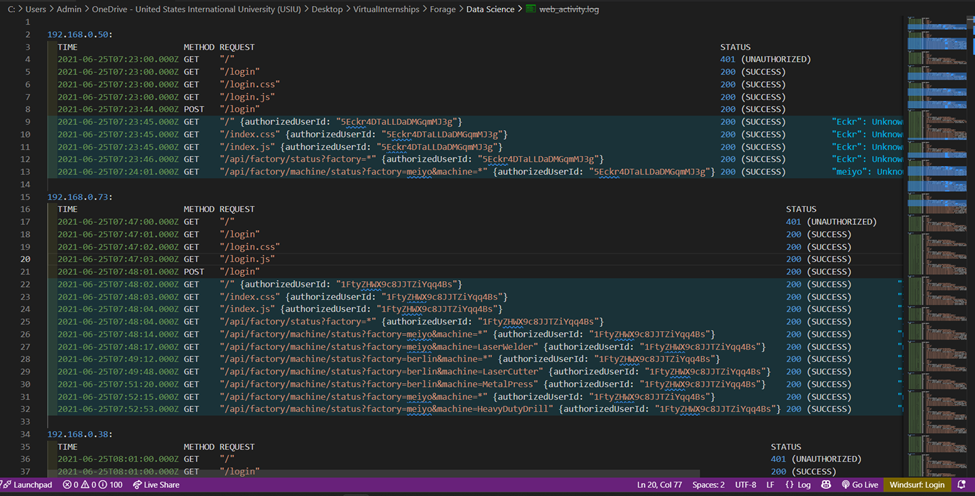
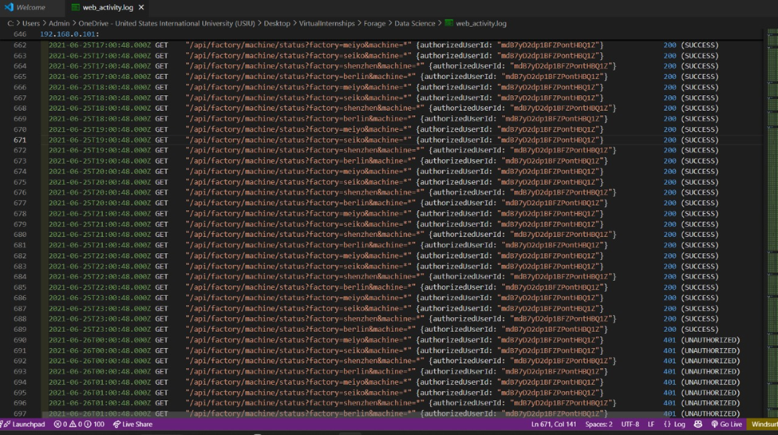

# Deloitte-Australia-Cyber-Job-Simulation-on-Forage: Daikibo Industrials Cyber Breach Investigation

## Analyst name : Abdiaziz Ibrahim Kar

## BACKGROUND INFORMATION
A major news publication has revealed sensitive private information about Daikibo Industrials, our client. A production problem has caused its assembly lines to stop, threatening the smooth operation of supply chains relying on Daikibo’s products. The client suspects the security of their new status board, Daikibo's telemetry dashboard may have been breached.

## Tasks Assigned
1. Determine if the alleged breach could have happened from an attacker on the internet directly (i.e. no access to Daikibo's VPN).
2. Inspect a web_requests.log file.

**Provided**: web_requests.log

### 1. Determining if the alleged breach could have happened from an attacker on the internet

**Analysis:**
The first step of the analysis was to check the IP addresses that have had interactions with Daikibo's telemetry dashboard. I observed that all those addresses were class C, private (internal), ruling out direct internet attacks.

**Findings:**
Attack Origin: Internal only (all IPs were private addresses).  
Evidence: No public IPs.

### 2. web_requests.log file Inspection

**Analysis:**
To identify user ID and IP address of the attacker, my initial priority was to review at request timestamps for any use of automated tools. The analysis revealed user that sends GET request to check status, **in every first 48th second of every hour**, machine-like precision. The user automates what seems to be a **brute-force attack on the endpoint /api/factory/machine/status** . Additionally, there is **use of wildcards** in some API requests, a clear indication of **automated scraping**. 

Moreover, Legitimate user traffic would typically include requests for **static assets like CSS stylesheets and images**. The absence of these requests strongly suggests automated tooling. Within the same second, the user makes multiple rapid requests with different parameters, further indicating automation. 

**Findings**
Internal Attacker details: **UserID=mdB7yD2dp1BFZPontHBQ1Z   IP: 192.168.0.101**  
Evidence:  
- API calls every first 48th second, of every hour.
- Wildcard usage factory=*
- Not loading static assets like stylesheets (css)

